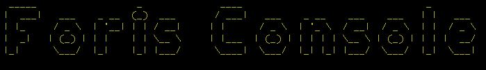

# Test Challenge Foris

Partiendo del lado conceptual, sabemos que un problema puede ser abordado de diferentes maneras. En este caso, se aborda la solución de la siguiente manera: 

## Estructura

### Data
Esta carpeta esta destinada a los archivos que manejaran almacenaran la data. En este caso sencillo por tratarse de data no persistente se manejó un archivo que simplemente contiene dos arrays, estos a su vez almacenan la data de Estudiantes y Asistencias simulando el funcionamiento de una "tabla". Si fuese el caso de tablas reales en esta carpeta se podria manejar las llamadas a BD por ejemplo.

### Images
La función de esta carpeta es simple, tener imagenes para este archivo Readme.md en este caso solo contiene 1 imagen. La que se observa mas arriba.

### Logic
Contiene la lógica donde se manejan imagenes para este archivo Readme.md en este caso solo contiene 1 imagen. La que se observa mas arriba.
